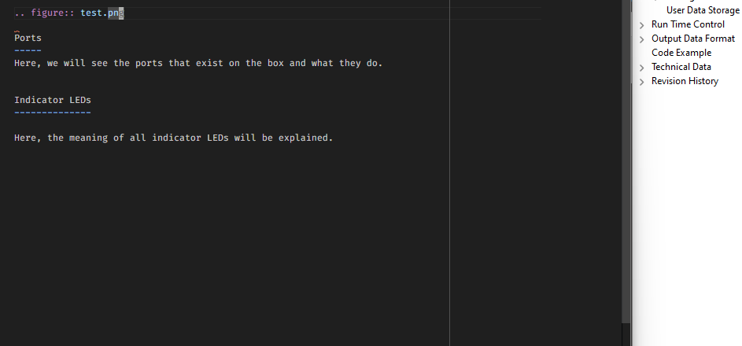

Hardware
========

The PCIe-to-USB4 adapter enables direct connection of our time-to-digital 
converters via USB4/Thunderbolt while keeping the same Driver Programming API 
for a connection via PCIe.

:numref:`Figure %s<fig1>` gives an overview of the adapter and
:numref:`Tab. %s<tab1>` gives an overview of the interface.

.. _fig1:

    
    Dummy picture. For a description of the labels, see :numref:`Tab. %s<tab1>`.

.. tabularcolumns:: c|c

.. _tab1:
.. table:: Interface of the Thunderbolt2PCIe adapter.

    =====  ===========
    Label  Description
    =====  ===========
    \(1)    Input for external power supply
    \(2)    USB-C / Thunderbolt connector
    \(3)    Status LED external power supply
    \(4)    Status LED for power supply over USB-C
    =====  ===========

Section
-------

Subsection
~~~~~~~~~~

Subsubsection
^^^^^^^^^^^^^

Paragraph
'''''''''